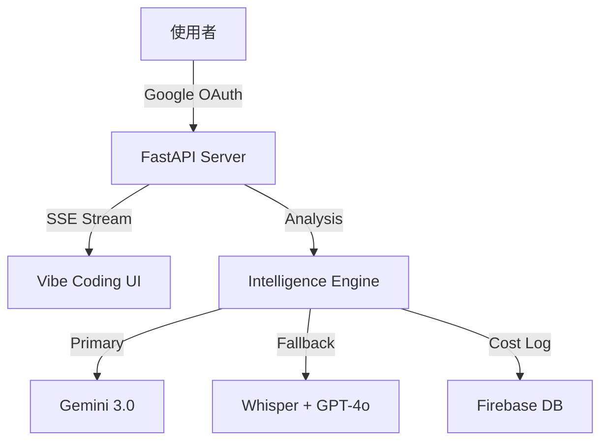

# Youtube Intelligence Web App (Youtube 智慧大腦)

> **Unlock the Wisdom of Video.**
> 不僅僅是摘要。這是您的第二大腦，將數小時的影音內容轉化為可執行的結構化洞察。

## ✨ 核心特色 (Unique Selling Points)

### 1. 🧠 Gemini 3 Flash Preview 核心引擎
使用 Google 最新的 **Gemini 3 Flash Preview** 模型直接「觀看」與「理解」影片內容。具備極速回應能力與長文本上下文視窗，超越傳統逐字稿限制，能夠捕捉語氣、畫面脈絡與深層含義。

### 1.1 🎥 長影片無縫解析 (Long Video Support)
針對超過 3 小時的超長影片 (如法說會、長時間直播)，系統具備自動切換的 **Audio Fallback** 機制。當影片超過 Gemini 視覺分析限制時，會自動下載音訊並上傳分析，確保內容不漏接。內建 **PO Token** 技術有效繞過 Bot 偵測。

### 1.2 ✨ 來源回溯 (Source Attribution)
自動生成的筆記中包含 `[來源: URL]` 連結，方便您隨時點擊回溯原始影片片段，確保資訊來源透明可查。

### 1.3 📊 NoteSlide 簡報生成器 (New)
類似 `codia.ai` 的簡報生成引擎。
- **PDF to PPTX**：支援上傳 NotebookLM 匯出的 PDF 文件。
- **Gemini Vision**：利用 AI 視覺模型識別每一頁的投影片結構、重點與備忘錄。
- **自動化排版**：一鍵將靜態 PDF 轉化為完全可編輯的 PowerPoint (.pptx) 檔案。

### 2. 💰 智慧成本監控 (Smart Cost Control)
- **Token 級追蹤**：精準計算 GPT-4o Input/Output Token 與 Whisper 分鐘數。
- **預算警示**：內建每月 $20 USD 預算監控，超過額度自動在 UI 發出紅色警報。
- **Firebase Persistence**：整合 Firebase Realtime Database，成本數據永久保存，不受伺服器休眠影響。

### 3. 🔓 開放架構與 BYOK (Public by Default)
- **全面開放**：移除強制登入限制，訪客可立即使用。
- **Bring Your Own Key**：支援使用者輸入自己的 Google / OpenAI API Key。
- **隱私優先**：金鑰僅儲存於本地瀏覽器 (localStorage)，從不經過資料庫，確保您的配額安全。
- **混合模式**：保留 Google OAuth 供內部團隊使用伺服器端金鑰，兼顧開放與管理。

### 4. 🎨 Vibe Coding 現代化介面
- **Premium UI**：深色玻璃擬態 (Glassmorphism)、流暢動畫與響應式設計。
- **Real-time Console**：SSE (Server-Sent Events) 技術驅動的即時終端機日誌。
- **PWA Ready**：支援「加入主畫面」，提供如同原生 App 的全螢幕體驗與專屬 Icon。
- **Live Demo**：首頁動態終端機模擬，展現科技感。
- **NotebookLM 對比**：強調「深度客製化」、「數據主權」與「自動化潛力」三大優勢。

### 5. ☁️ Cloud Run 極速架構
- **無冷啟動 (No Cold Start)**：遷移至 Google Cloud Run，解決 Render 喚醒延遲。
- **Auto-Scaling**：自動與 0 機制，兼顧效能與成本。
- **Playwright 優化**：專為 Cloud Run 優化的 Headless Chrome 配置 (Watch Page Mode)。

### 5. 📝 結構化輸出生態系
- **Markdown Native**：產出的筆記可直接貼入 **Heptabase**、**Obsidian** 或 **Notion**。
- **一鍵匯出**：支援複製到剪貼簿與下載 .md 檔案。

---

## 🛠 安裝與啟動

### 1. 複製專案
```bash
git clone https://github.com/bangdoll/youtube_summary.git
cd youtube_summary
```

### 2. 安裝依賴
```bash
pip install -r requirements.txt
# 需確保已安裝 ffmpeg (用於音訊處理)
```

### 3. 設定環境變數 (.env)
請參考 `.env.example` 或直接建立 `.env`：

```bash
# Core AI Services
GOOGLE_API_KEY=AIza...          # Gemini 3.0 (主要)
OPENAI_API_KEY=sk-...           # GPT-4o (備用)

# Authentication (Google OAuth)
GOOGLE_CLIENT_ID=...
GOOGLE_CLIENT_SECRET=...
ALLOWED_EMAILS=user@example.com,admin@example.com
SECRET_KEY=...                  # Session 加密亂數

# Cost Persistence (Firebase)
FIREBASE_DB_URL=https://your-project.firebaseio.com/
FIREBASE_CREDENTIALS={...json content...}
```

### 4. 啟動伺服器 (Local)
```bash
python3 -m uvicorn main:app --reload
```
訪問 http://localhost:8000 即可使用。

### ☁️ 部署 (Google Cloud Run)
本專案專為 **Google Cloud Run** 優化，解決 Render 免費版冷啟動延遲問題。

1. **推送至 GitHub**
2. **在 Cloud Run 建立服務**：選擇 `Continuously deploy from a repository`
3. **設定環境變數**：填入上述 Key 與 `FIREBASE_CREDENTIALS` (JSON)
4. **設定資源**：**建議記憶體 2 GiB** (以支援 Playwright 無頭瀏覽器)
5. **部署！** 🚀

---

## 🔧 架構圖 (Architecture)



## 📄 License
MIT
