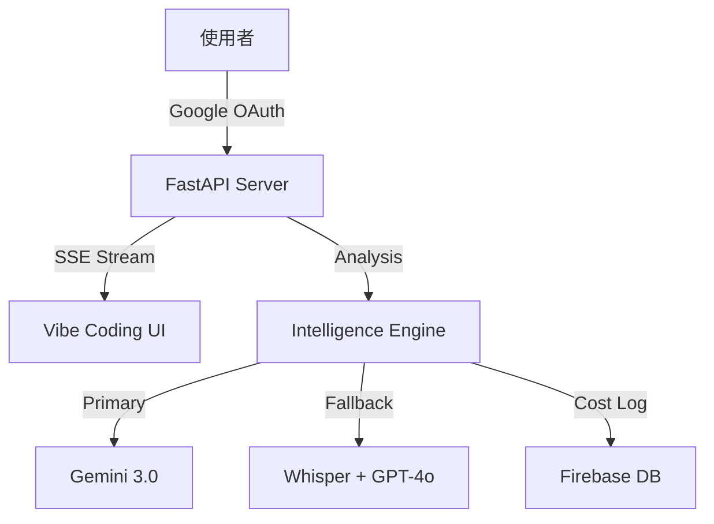

# 🌈 PrismFlow (原: Second Brain OS)

> **Refracting Chaos into Clarity.**
> 稜鏡流 PrismFlow｜將零散知識結構化，輕鬆生成可編輯簡報。

## ✨ 核心特色 (Unique Selling Points)

### 1. 🧠 Gemini 3 Flash Preview 核心引擎
使用 Google 最新的 **Gemini 3 Flash Preview** 模型直接「觀看」與「理解」影片內容以及進行簡報分析。具備極速回應能力與長文本上下文視窗，超越傳統逐字稿限制，能夠捕捉語氣、畫面脈絡與深層含義。

### 1.1 🎥 長影片無縫解析 (Long Video Support)
針對超過 3 小時的超長影片 (如法說會、長時間直播)，系統具備自動切換的 **Audio Fallback** 機制。當影片超過 Gemini 視覺分析限制時，會自動下載音訊並上傳分析，確保內容不漏接。內建 **PO Token** 技術有效繞過 Bot 偵測。

### 1.2 ✨ 來源回溯 (Source Attribution)
自動生成的筆記中包含 `[來源: URL]` 連結，方便您隨時點擊回溯原始影片片段，確保資訊來源透明可查。

### 1.3 📊 NoteFlux 簡報生成器 (NoteFlux Generator) v7.0
獨家「圖文分離」與「線上編輯」引擎，解決傳統 PDF 轉 PPTX 的排版錯亂問題。

- **🆕 Session ID 後端暫存機制 (v7.0.0)**：
    - **根治 413 Payload Too Large**：不再將圖片從前端傳回後端，改由後端使用 Session ID 暫存，徹底解決高畫質 PDF 因 Payload 過大導致生成失敗的問題。
    - **Analyses 清理**：發送前自動移除 `_visual_crops` 等大型 Base64 資料，將 Payload 從 10+MB 降至約 50KB。
- **🆕 AI 預覽疊加層 (Preview Overlay)**：
    - **BBox 視覺化**：新增切換開關，可在編輯器中直接顯示 AI 偵測的文字邊界框 (Bounding Box)。
    - **區塊詳情面板 (Block Details Panel)**：展開即可查看每個文字區塊的字型大小與顏色，支援即時編輯。

- **🆕 Native Hybrid Engine (v3.0.0 核心)**：
    - **原生文字提取**：使用 `pypdf` 直接從 PDF 文字層提取內容，達成 **100% 文字正確率**，徹底繞過 OCR 錯誤。
    - **物理遮罩去字**：根據文字座標繪製物理遮罩，再由 AI Inpainting 填補背景，保證 **零文字殘留**。
    - **智慧降級**：若偵測到掃描式 PDF（無文字層），自動切回 Vision AI 分析模式。
- **Web 簡報內容編輯器 (Web Slide Editor)**：
    - **所見即所得**：上傳 PDF 後，先預覽分析結果，直接在網頁上修改標題與重點，確認無誤再生成檔案。
    - **即時進度條 (Real-time Progress)**：全新串流技術，即時顯示 AI 分析進度與百分比，告別漫長等待的黑盒子。
    - **完全可控**：再也不用為了改一個錯字而重新生成整份簡報。
- **乾淨分離版面 (Clean Split Layout)**：
    - **AI 圖片去字**：整合 **Gemini 3 Pro Image Preview** 模型，自動擦除原始圖片上的文字，保留乾淨背景。
    - **移除 NotebookLM 圖標**：新增一鍵移除頁面底部 NotebookLM Logo 與頁碼的功能，讓簡報看起來更專業。
    - **圖文不打架**：強制採用「左圖右文」工整排版，徹底杜絕文字重疊與 OCR 漂移問題。
- **像素級 Shape 重建**：每個文字區塊都是獨立的 PowerPoint Shape，而非死圖。
- **Codia 風格網格預覽**：直觀的頁面選擇介面，支援全選/取消全選。

### 2. 💰 智慧成本監控 (Smart Cost Control)
- **Token 級追蹤**：精準計算 GPT-4o Input/Output Token 與 Whisper 分鐘數。
- **預算警示**：內建每月 $20 USD 預算監控，超過額度自動在 UI 發出紅色警報。
- **Firebase Persistence**：整合 Firebase Realtime Database，成本數據永久保存，不受伺服器休眠影響。

### 3. 🔓 開放架構與 BYOK (Public by Default)
- **全面開放**：移除強制登入限制，訪客可立即使用。
- **Bring Your Own Key**：支援使用者輸入自己的 Google / OpenAI API Key。
- **隱私優先**：金鑰僅儲存於本地瀏覽器 (localStorage)，從不經過資料庫，確保您的配額安全。
- **混合模式**：保留 Google OAuth 供內部團隊使用伺服器端金鑰，兼顧開放與管理。

### 4. 🎨 Vibe Coding 現代化介面
- **Premium UI**：深色玻璃擬態 (Glassmorphism)、流暢動畫與響應式設計。
- **Real-time Console**：SSE (Server-Sent Events) 技術驅動的即時終端機日誌。
- **PWA Ready**: 完整支援 PWA 標準 (Manifest V2)，提供「加入主畫面」功能，擁有獨立 App Icon 與全螢幕沉浸體驗。
- **Live Demo**：首頁動態終端機模擬，展現科技感。
- **NotebookLM 對比**：強調「深度客製化」、「數據主權」與「自動化潛力」三大優勢。

### 5. ☁️ Cloud Run 極速架構
- **無冷啟動 (No Cold Start)**：遷移至 Google Cloud Run，解決 Render 喚醒延遲。
- **Auto-Scaling**：自動與 0 機制，兼顧效能與成本。
- **Playwright 優化**：專為 Cloud Run 優化的 Headless Chrome 配置 (Watch Page Mode)。

### 5. 📝 結構化輸出生態系
- **Markdown Native**：產出的筆記可直接貼入 **Heptabase**、**Obsidian** 或 **Notion**。
- **一鍵匯出**：支援複製到剪貼簿與下載 .md 檔案。

---

## 🛠 安裝與啟動

### 1. 複製專案
```bash
git clone https://github.com/bangdoll/youtube_summary.git
cd youtube_summary
```

### 2. 安裝依賴
```bash
pip install -r requirements.txt
# 需確保已安裝 ffmpeg (用於音訊處理)
```

### 3. 設定環境變數 (.env)
請參考 `.env.example` 或直接建立 `.env`：

```bash
# Core AI Services
GOOGLE_API_KEY=AIza...          # Gemini 3.0 (主要)
OPENAI_API_KEY=sk-...           # GPT-4o (備用)

# Authentication (Google OAuth)
GOOGLE_CLIENT_ID=...
GOOGLE_CLIENT_SECRET=...
ALLOWED_EMAILS=user@example.com,admin@example.com
SECRET_KEY=...                  # Session 加密亂數

### 4. 自動部署 (GitHub Actions)
若要啟用自動部署至 Cloud Run，請在 GitHub Repository Settings -> Secrets and variables -> Actions 新增以下 Secrets:

- **GCP_PROJECT_ID**: Google Cloud 專案 ID
- **GCP_SA_KEY**: Service Account JSON Key (需具備 Cloud Run Admin 與 Storage Admin 權限)
- **其他變數**: 建議將 `.env` 中的敏感資訊 (GOOGLE_CLIENT_ID, SECRET_KEY 等) 也設定為 GitHub Secrets，透過 workflow 注入。

# Cost Persistence (Firebase)
FIREBASE_DB_URL=https://your-project.firebaseio.com/
FIREBASE_CREDENTIALS={...json content...}
```

### 4. 啟動伺服器 (Local)
```bash
python3 -m uvicorn main:app --reload
```
訪問 http://localhost:8000 即可使用。

### ☁️ 部署 (Google Cloud Run)
本專案專為 **Google Cloud Run** 優化，解決 Render 免費版冷啟動延遲問題。

1. **推送至 GitHub**
2. **在 Cloud Run 建立服務**：選擇 `Continuously deploy from a repository`
3. **設定環境變數**：填入上述 Key 與 `FIREBASE_CREDENTIALS` (JSON)
4. **設定資源**：**必須設定為 2 GiB RAM / 2 vCPU 以上** (由於 PDF 圖像處理需要較大記憶體，512MB 預設值會導致崩潰)
5. **部署！** 🚀

---

## 🔧 架構圖 (Architecture)


```mermaid
graph TD
    User[使用者] -->|Google OAuth| Web[FastAPI Server]
    Web -->|SSE Stream| UI[Vibe Coding UI]
    Web -->|Analysis| Engine[Intelligence Engine]
    
    Engine -->|Primary| Gemini[Gemini 3.0]
    Engine -->|Fallback| Whisper[Whisper + GPT-4o]
    
    Engine -->|Cost Log| Firebase[Firebase DB]
```

## 📄 License
MIT
